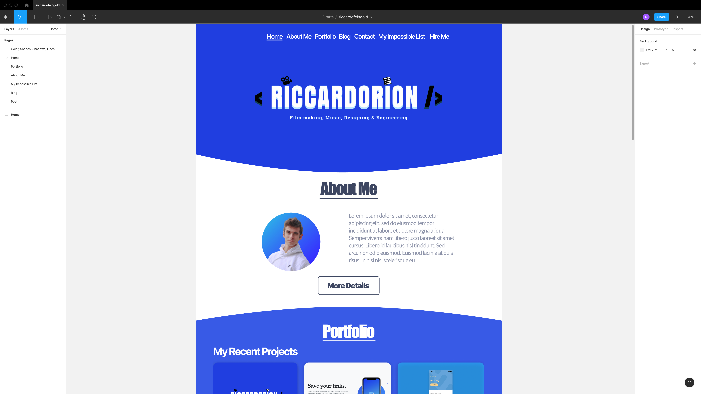

Hurray! 🥳 The last exam is finally done, and the well-deserved holidays have come. Whereas most of my colleagues traveled to Italy or Portugal, I decided to stay in Switzerland and build my blog. 

So, where did I start? I started my coding journey by first designing my website with Figma.

It’s an incredible tool when it comes to designing UI/UX for apps or websites. Here you only focus on the design aspects and forget about how you actually should code it. That’s extremely useful later on since you don’t need to think about the look of your site anymore. So be sure you do that first.

After I got my design for my website, I started to learn about Gatsby and how to use it for my project. They’ve got an incredible tutorial on their [website](https://www.gatsbyjs.com/docs/tutorial/). This site helped me a lot when getting started with their framework. 

With my Gatsby site set up, I began to implement the design I had created with Figma using Bootstrap and some additional CSS files to override the default theme of Bootstrap. Maybe you want to check out this [Stackoverflow](https://mailchimp.com/pricing/marketing/) answer if you come up with some problems integrating Bootstrap in Gatsby. 

While coding the front-end of my website, I asked myself how can I add a CMS from where my website can source my posts. For that, Gatsby provides you with a great collection of plugins that you can easily incorporate into your website, including one for handling posts written on Ghost. With this, you can filter your posts using [Graphql](https://www.gatsbyjs.com/docs/graphql/) queries.

The last thing I wanted to add to my site were some forms. I created one for collecting email addresses and the other for getting in touch with me. Since I did not want to build a whole mail server from scratch, I searched for third-party solutions like [getform.io](https://getform.io) and [Mailchimp](https://mailchimp.com/pricing/marketing/). Both offer a free plan, which is for my purpose enough.

The last steps before deploying my site to Netlify were to add a sitemap.xml and a robots.txt file. Additionally, I created an SEO component with React to optimize my website for Google searches. For that, I recommend checking out [this article](https://frontend-digest.com/a-technical-guide-to-seo-with-gatsby-js-e88a7dac80f0) on Medium.

As I mentioned before, I deployed the front-end of my website on [Netlify](https://www.netlify.com/). But for the Ghost CMS, I used [Digital Ocean](https://www.digitalocean.com/). It is not necessary to make your CMS publicly available too. You can have it also locally on your computer. But by deploying your Ghost CMS too, you can publish from everywhere and from any device, which is not possible with a local Ghost CMS.

And this is how my journey of programming my blog with Gatsby and Ghost ended. Hoped you enjoyed it and became motivated to claim your place in the internet world with your beautiful website too! 

If you have any questions, feel free to contact me. You will find my social media links in the footer, or you can use my contact form. What you prefer 😉
